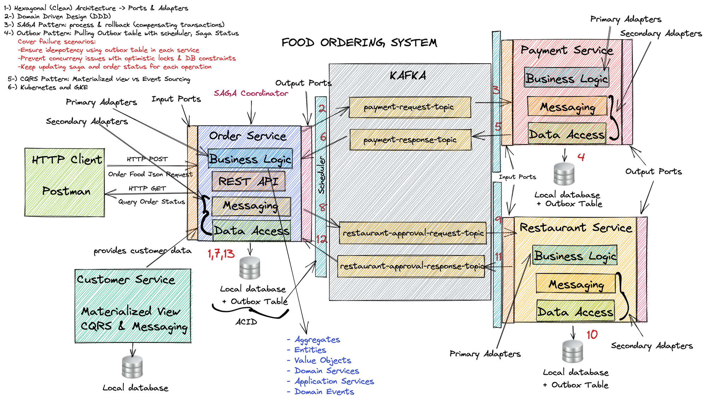
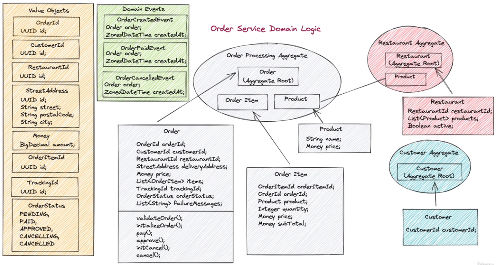

# food-ordering

This is a food ordering system using DDD and clean architecture concepts. 
For this project, the reference used is the course "<em>Learn Spring boot microservices with Clean & Hexagonal architectures, DDD, SAGA, Outbox, CQRS, Kafka, Kubernetes & GKE</em>" by **Ali Gelenler**, in Udemy plataform: <a>https://www.udemy.com/course/microservices-clean-architecture-ddd-saga-outbox-kafka-kubernetes</a>.

The project design used in this development is:

---

The order service has the following architecture:

